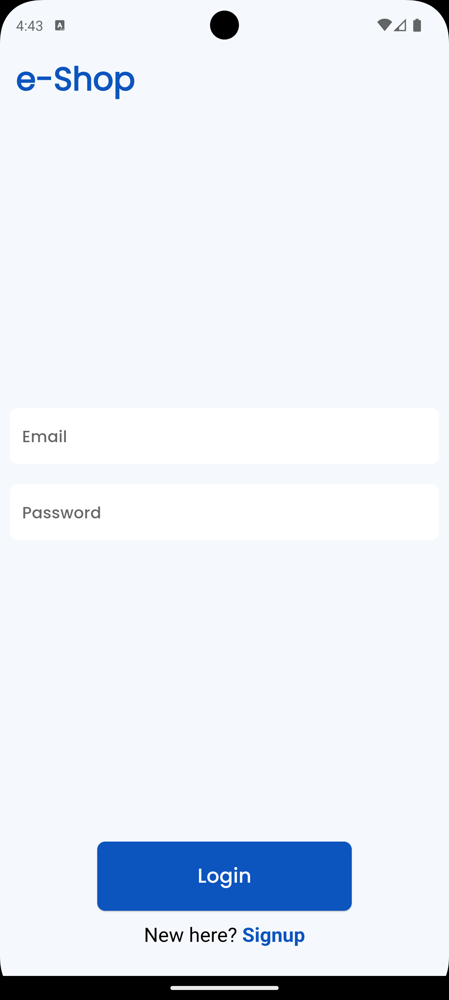
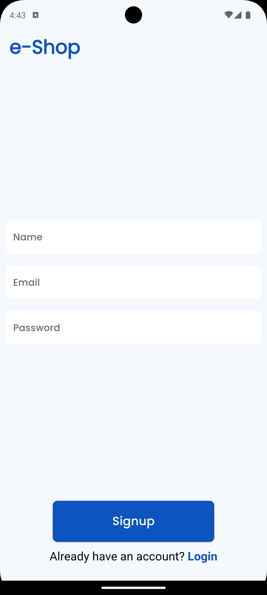
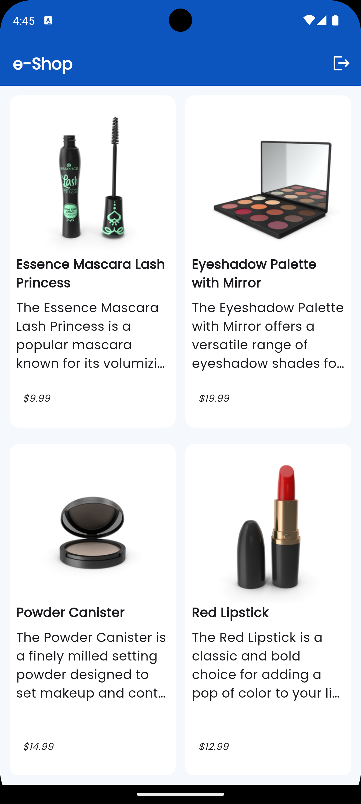

# cartgo

e-commerce app example which uses Firebase Authentication, Firebase Remote Config and will fetch products from https://dummyjson.com/products as per the specified designs.

### Auth screens

### products screen
